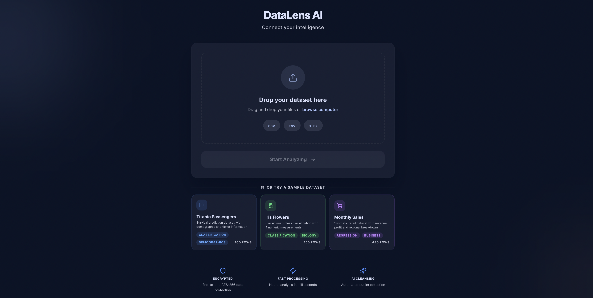
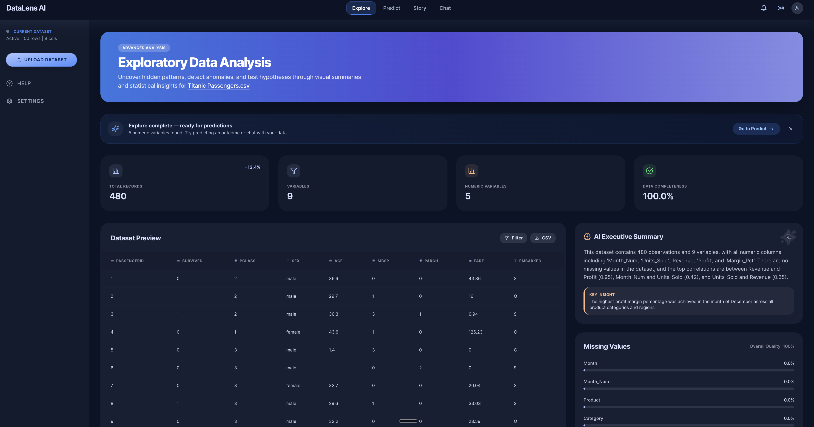
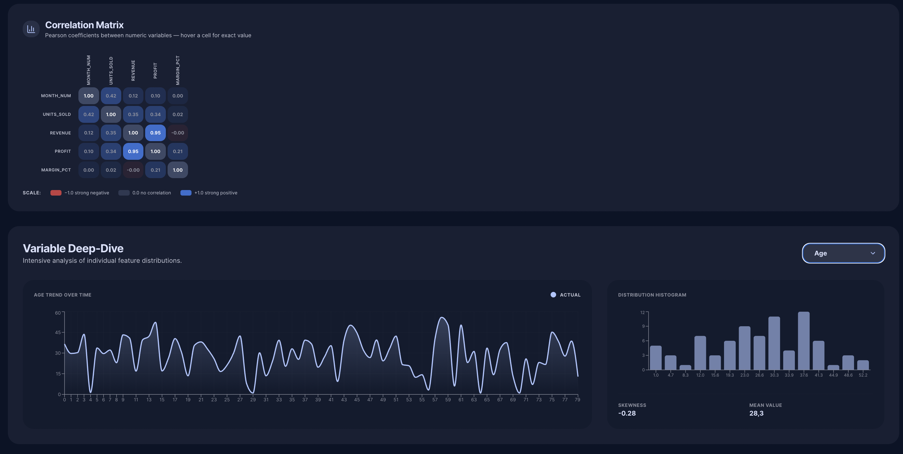
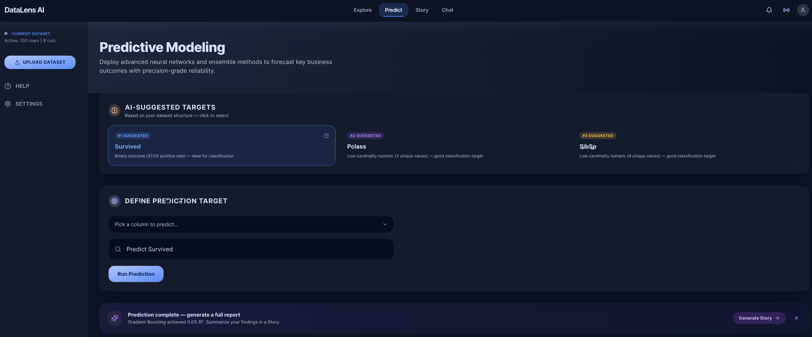
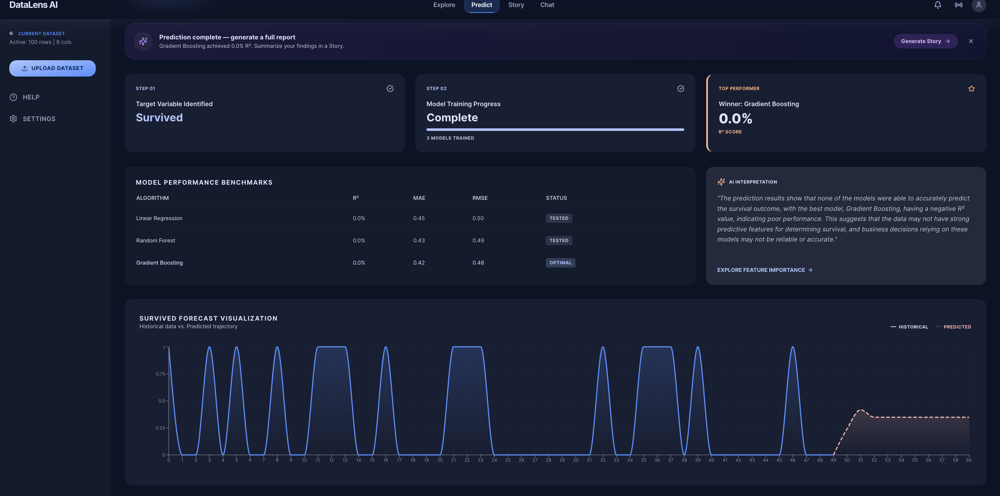
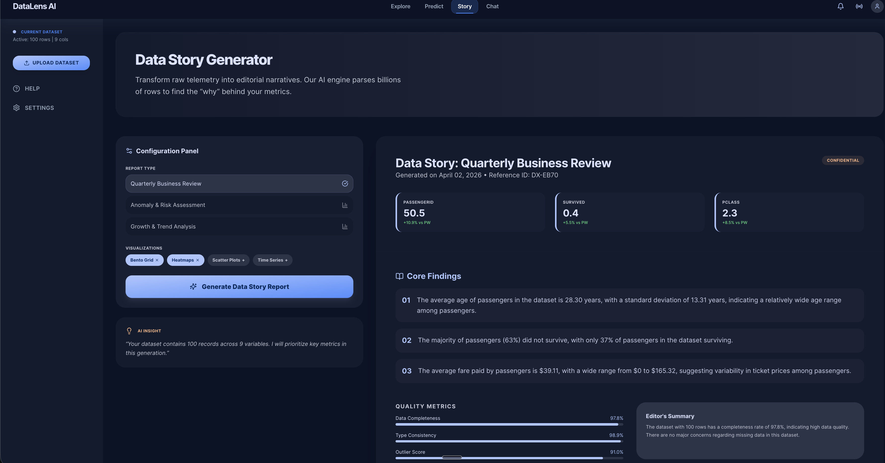
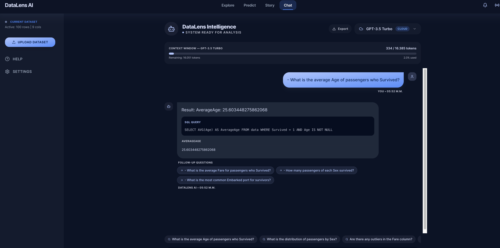

<div align="center">

# DataLens AI

### Smart Data Analysis with LLMs

**Upload any dataset and instantly explore, predict, generate reports, and chat with your data using natural language — no technical skills required.**

[](https://nextjs.org/)
[](https://fastapi.tiangolo.com/)
[](https://python.org/)
[](https://typescriptlang.org/)
[](LICENSE)

</div>

---

## What is DataLens AI?

DataLens AI is a full-stack data analysis platform that combines **Exploratory Data Analysis**, **Machine Learning Predictions**, **AI-Generated Reports**, and a **Multi-Model Chatbot** — all through an intuitive dark-themed UI.

Simply upload a CSV, TSV, or Excel file and the platform handles everything: statistics, visualizations, forecasting, and natural language querying of your data.

<div align="center">

> *"Ask your data anything — DataLens translates your questions into SQL, runs the query, and visualizes the answer."*

</div>

---

## Features at a Glance

| Feature | Description |
|---------|-------------|
| **Dataset Upload** | Drag & drop CSV, TSV, or XLSX files with instant parsing and quality metrics |
| **Exploratory Data Analysis** | Auto-generated statistics, correlations, distributions, trend charts, and AI summaries |
| **Predictive Modeling** | Train Linear Regression, Random Forest, and Gradient Boosting models with one click |
| **Data Story Generator** | AI-powered report generation with KPIs, findings, quality metrics, and PDF export |
| **Multi-Model Chatbot** | Query your data in natural language using 4 AI models with SQL generation and visualization |
| **Dark Theme UI** | Built with the Stitch design system for a modern, professional look |

---

## Screenshots

### Upload Screen
Upload your dataset with a simple drag-and-drop interface. Supports CSV, TSV, and XLSX formats.



### Explore Tab — Exploratory Data Analysis
Get instant KPIs, dataset preview with filtering, AI executive summaries, missing value analysis, and deep-dive variable distributions.




### Predict Tab — Predictive Modeling
Define a prediction target in plain English. The system trains 3 ML models, picks the best, and generates a forecast chart.




### Story Tab — AI Report Generator
Generate editorial-quality data reports with KPIs, core findings, quality metrics, and export to PDF.



### Chat Tab — Multi-Model AI Chatbot
Chat with your data using natural language. Choose between cloud and local models. See the generated SQL, data tables, and auto-generated charts.



---

## Architecture

```
datalens-ai/
├── frontend/                  # Next.js 14 + React + TypeScript
│   ├── src/
│   │   ├── app/               # Next.js pages & layout
│   │   ├── components/
│   │   │   ├── layout/        # Sidebar, TopNav, DashboardLayout
│   │   │   ├── onboarding/    # UploadZone (drag & drop)
│   │   │   └── tabs/          # ExploreTab, PredictTab, StoryTab, ChatTab
│   │   ├── lib/
│   │   │   ├── api.ts         # API client (all backend calls)
│   │   │   └── store.ts       # Zustand state management
│   │   └── types/             # TypeScript interfaces
│   └── tailwind.config.ts     # Stitch dark theme tokens
│
├── backend/                   # FastAPI + Python
│   ├── main.py                # App entry point, CORS, router mounting
│   ├── routers/
│   │   ├── upload.py          # File parsing (CSV/TSV/XLSX) + SQLite
│   │   ├── eda.py             # Statistics, correlations, AI summaries
│   │   ├── predict.py         # ML training, forecasting, interpretation
│   │   ├── story.py           # AI report generation
│   │   └── chat.py            # NL-to-SQL with 4 model backends
│   ├── requirements.txt
│   └── .env                   # API keys (not committed)
│
└── docs/screenshots/          # App screenshots for README
```

---

## AI Models

The Chatbot tab supports **4 AI models** — 1 cloud-based and 3 local:

| Model | Provider | Context Window | Description |
|-------|----------|---------------|-------------|
| **GPT-3.5 Turbo** | OpenAI (Cloud) | 16,385 tokens | Fast, accurate SQL generation via OpenAI API |
| **LLaMA 3.1** | Ollama (Local) | 131,072 tokens | Meta's open-source model, largest context window |
| **Mistral** | Ollama (Local) | 32,768 tokens | Efficient European open-source model |
| **Qwen 2.5** | Ollama (Local) | 32,768 tokens | Alibaba's multilingual open-source model |

Each model displays a **context window meter** showing token usage in real time.

---

## Tech Stack

### Frontend
- **Next.js 14** — React framework with App Router
- **TypeScript** — Type-safe development
- **Tailwind CSS** — Utility-first styling with custom Stitch dark theme
- **Zustand** — Lightweight state management
- **Recharts** — Interactive charts and visualizations
- **Lucide React** — Icon library

### Backend
- **FastAPI** — High-performance Python API framework
- **Pandas** — Data manipulation and analysis
- **Scikit-learn** — Machine learning (Linear Regression, Random Forest, Gradient Boosting)
- **OpenAI SDK** — GPT-3.5 Turbo integration
- **Ollama** — Local LLM inference (LLaMA, Mistral, Qwen)
- **SQLite** — In-memory database for SQL queries on uploaded data
- **Matplotlib** — Server-side chart generation

---

## Getting Started

### Prerequisites

- **Node.js** 18+ and **npm**
- **Python** 3.11+
- **Ollama** (for local models) — [Install Ollama](https://ollama.ai)
- **OpenAI API Key** (for GPT-3.5)

### 1. Clone the repository

```bash
git clone https://github.com/VagKaran/DataLens-AI.git
cd DataLens-AI
```

### 2. Set up the backend

```bash
cd backend

# Create and activate virtual environment
python3 -m venv venv
source venv/bin/activate  # On Windows: venv\Scripts\activate

# Install dependencies
pip install -r requirements.txt

# Configure environment variables
cp .env.example .env
# Edit .env and add your OpenAI API key:
#   OPENAI_API_KEY=sk-your-key-here
#   OLLAMA_BASE_URL=http://localhost:11434

# Start the backend server
uvicorn main:app --host 0.0.0.0 --port 8000 --reload
```

### 3. Set up the frontend

```bash
cd frontend

# Install dependencies
npm install

# Start the development server
npm run dev
```

### 4. Pull local models (optional, for local AI)

```bash
ollama pull llama3.1
ollama pull mistral
ollama pull qwen2.5
```

### 5. Open the app

Navigate to **http://localhost:3000** in your browser. Upload a dataset and start exploring!

---

## Environment Variables

Create a `.env` file in the `backend/` directory:

```env
OPENAI_API_KEY=sk-your-openai-api-key-here
OLLAMA_BASE_URL=http://localhost:11434
```

| Variable | Required | Description |
|----------|----------|-------------|
| `OPENAI_API_KEY` | Yes | OpenAI API key for GPT-3.5 Turbo |
| `OLLAMA_BASE_URL` | No | Ollama server URL (defaults to `http://localhost:11434`) |

---

## How It Works

### 1. Upload
Drop a CSV, TSV, or XLSX file. The backend parses it with Pandas, computes data quality metrics, and loads it into an in-memory SQLite database for chatbot queries.

### 2. Explore
The EDA engine calculates descriptive statistics, correlation matrices, and missing value patterns. GPT-3.5 generates an executive summary highlighting key patterns. Use the Variable Deep-Dive for distribution histograms and trend charts.

### 3. Predict
Describe what you want to predict in plain English (e.g., *"Predict Close price for next 30 days"*). The system extracts the target variable, engineers lag features, trains 3 ML models, benchmarks them (R², MAE, RMSE), and generates a forecast visualization.

### 4. Story
Select a report type (Quarterly Review, Anomaly Assessment, or Growth Analysis). The AI generates KPIs from your data, writes key findings, and produces a downloadable PDF report.

### 5. Chat
Ask questions about your data in natural language. The selected AI model translates your question to SQL, executes it against the SQLite database, and returns the answer with auto-generated charts (bar, line, pie, scatter, histogram).

---

## Contributing

Contributions are welcome! Please feel free to submit a Pull Request.

---

## License

This project is licensed under the MIT License — see the [LICENSE](LICENSE) file for details.

---

<div align="center">

**Built with AI-powered intelligence by [VagKaran](https://github.com/VagKaran)**

</div>
